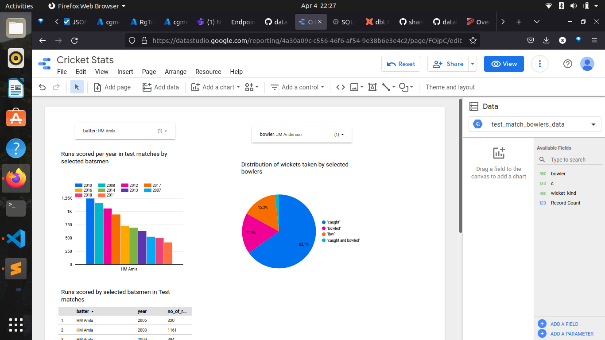

<!-- ABOUT THE PROJECT -->
## About The Project

Cricket Stats extracts ball-by-ball cricket data from https://cricsheet.org/ to analyze the players.

It uses Apache Airflow to orchestrate data extraction for matches played each year(Since 2004). There is a zip file for each year which contains json files which have data for all matches played in that year.

Each json files has information which follows this format (https://cricsheet.org/format/json/). We need info and innings section for our analysis.

Json files are processed and stored in google cloud storage as parquet files, this files are used to create table in BigQuery.

DBT(data build tool) is used to transform this raw data into schema which can be easily queried and visualized.


### Built With

* [Python](https://www.python.org/)
* [Apache Airflow](https://airflow.apache.org/)
* [Data Build Tool](https://www.getdbt.com/)
* [Google Bigquery](https://cloud.google.com/bigquery)


<!-- GETTING STARTED -->

## Instructions for building the project

### Building airflow environment for data ingestion

Follow [setup](data_ingestion/2_setup_official.md) to setup the required variables

Update GCP_PROJECT_ID and GCP_GCS_BUCKET valriables in [docker-compose](data_ingestion/docker-conpose.yaml)

```bash
cd data_ingestion
docker compose build
docker compose up airflow-init
docker compose up
```
This will start containers required by airflow. Airflow webserver can be accessed at http://localhost:8080/

Trigger `cric_data_ingestion_dag` DAG

This will extract all the required data and load it into google cloud storage.


### Making table in data warehouse Bigquery

We will use files stored in google cloud storage to create tables.

Run the queries in [external table creation](data_warehouse/external_table_creation.sql), this will create external tables.

Note: uris need to be updated for your storage account.

We optimize our database by clustering it based on match_type and partitioning it based on year.

We want to ananlyze data for specific match_type(Test, ODIa, T20...), this helps to qucikly get the data for a match type.

Partitioning tables on basis of Year helps, as we want to compare performance of batsmen or bowlers over the years.

Queries for optimizing are in [optimize tables](data_warehouse/optimizing_tables.sql)


### Making models for efficient analsis using DBT:

- Set up dbtcloud and initalize project.
- Add files from [cric_transform](cric_transform)
- staging models extract wickets and runs data from out tables.
- core models make data easy to query for our use case.

### Dashboard

Using google data studio for making dashboard.

Add two data sources, 1 for each core model created in dbt.

We visualize data for both models. One has data for runs scored by batsmen and other for wickets taken by bowlers.
Drop down controls can be used to select batsmen to select runs scored by him every year or select bowler to see the distribution of the types of wickets he has taken.




## Getting Started locally

To run this project locally you need to install docker, docker compose and dbt


Starting airflow

```bash
cd data_ingestion
docker compose build
docker compose up airflow-init
docker compose up
```
This will start containers required by airflow. Airflow webserver can be accessed at ...


Starting local postgres container

```bash
cd local_project
docker compose up
```

This will start postgres container which is used to store data for local development.

Installing dbt locally


1. Go to airflow webserver(..)
2. Select '' DAG and trigger it.(after it completes we will have all data in our local postgres DB)
3. Then go to `cric_transform` directory and run `dbt run` command.(this will run the models which can be used for analytics and to create dashboard)


<!-- ACKNOWLEDGMENTS -->
## Acknowledgments

- https://cricsheet.org/
